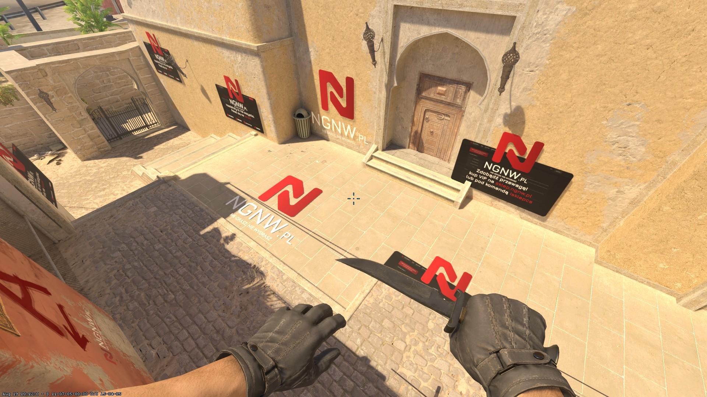

# CS2-Poor-MapPropAds

This plugin allows for server owners to create billboard type advertisements that are placed on wall.<br/>
This is almost 1:1 copy of my [CS2-Poor-MapDecals](https://github.com/Letaryat/CS2-Poor-MapDecals), but this uses models (vmdl) instead of vmat textures. It should not crash the server randomly but it does not look the same. Commands, logic etc is the same so you should decide which one you prefer to use and not use both at the same time. <br>
[](https://ko-fi.com/H2H8TK0L9)

## [📺] Video presentation
SoonTM
<p align="center">
    
</p>

- [Tutorial in Portuguese by alekfps0](https://www.youtube.com/watch?v=70zumLkba_U)


## [📌] Setup
- Download latest release,
- Drag files to /plugins/
- Restart your server,
- Config file should be created in configs/plugins/
- Edit to your liking,

## [📝] Configuration
| Option  | Description |
| ------------- | ------------- |
| Admin Flag (string) | Which flag will have access to all of the commands  |
| Vip Flag (string) | Which flag would not see advertisements that are not forced on vip users |
| Props Path (string[]) | Paths for all advertisements that your addon have |
| Enable commands (bool) | If you want commands to be enabled. (for example, after you placed all of the advertisements you might not need commands anymore) |
| Debug Mode (bool) | If plugin should log errors, etc |

### [📝] Config example:
```
{
  "Admin Flag": "@css/root",
  "Vip Flag": "@vip/noadv",
  "Props Path": [
	"models/Example/exampleTexture.vmdl", // ID 0
	"models/Example/exampleTexture2.vmdl" // ID 1 etc...
  ],
  "Enable commands": true,
  "Debug Mode": true,
  "ConfigVersion": 1
}
```

## [🛡️] Admin commands
Tried to make plugin idiot proof (since I did a lot of mistakes).
| Command  | Description |
| ------------- | ------------- |
| css_placedecals | Allow to place advertisements |
| css_setdecal **ID_OF_DECAL** **FORCE_ON_VIP (TRUE/FALSE)** | Configure decal that you want to place |
| css_pingdecals | Allows to place decals using Ping function |
| css_removedecal **ID** | Remove already placed decal using ID |
| css_tpdecal **ID** | Teleports to already existing decal using ID |
| css_showdecals | Prints info to console about all decals that are placed on map |
| css_printdecals | Prints a list of all decals that can be placed to console |

## [❤️] Special thanks to:
- [Edgegamers JailBreak](https://github.com/edgegamers/Jailbreak/blob/main/mod/Jailbreak.Warden/Paint/WardenPaintBehavior.cs#L131) - For function to check if player is looking at his pretty feet.

### [🚨] Plugin might be poorly written and have some issues. I have no idea what I am doing, but when tested it worked fine.